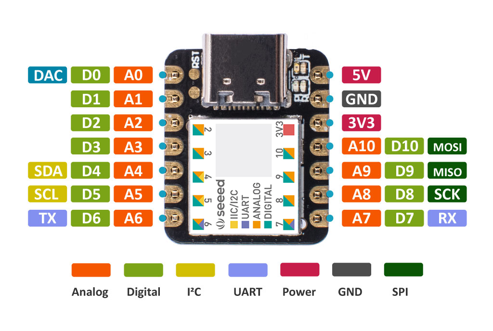

# WaveModuleWithSeeeduinoXiao

## ハードウェア接続

|SeeeduinoXiao|Grove Mp3 v2.0|
|:---:|:---:|
|RX|TX|
|TX|RX|
|3V3|VCC|
|GND|GND|

## Arduino IDE

### 書き込み設定

* ボード:Seeeduino Xiao

### ライブラリ

* SoftwareSerial
* MP3Player_KT403A.h
    * 公式ではないため[github](https://github.com/lemairec/rasika/blob/master/lib/MP3Player_KT403A/MP3Player_KT403A.h)からダウンロードし、ローカルに保存のこと

## 使用方法

### ホストPCの設定

* ボーレート:115200
* 改行コード:\r\n(=CR+LF)

### テラタームで使用する際の注意点

* エコーバックがないため注意すること
    * （Seeeduino Xiao側の青色LEDを頼りに送信されていることを確認する)

### コマンド

| コマンド | 変数 | 機能 | 詳細 |
| :--- | :--- | :--- | :--- |
| AT+PLAY=? | 1～N | 音声再生 | ?で指定した曲番号を生成する |
| AT+VOLCONF=? | 0～30 | 音量調整 | ?で指定した音量に設定する |